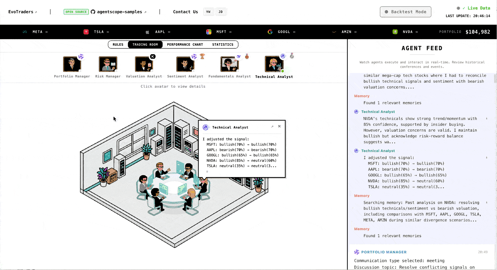
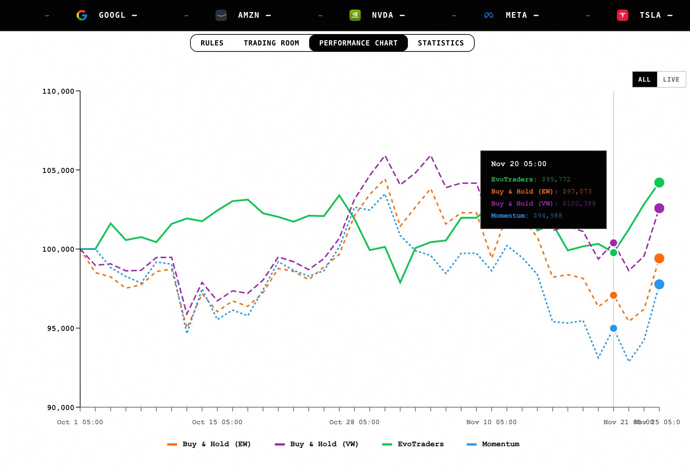
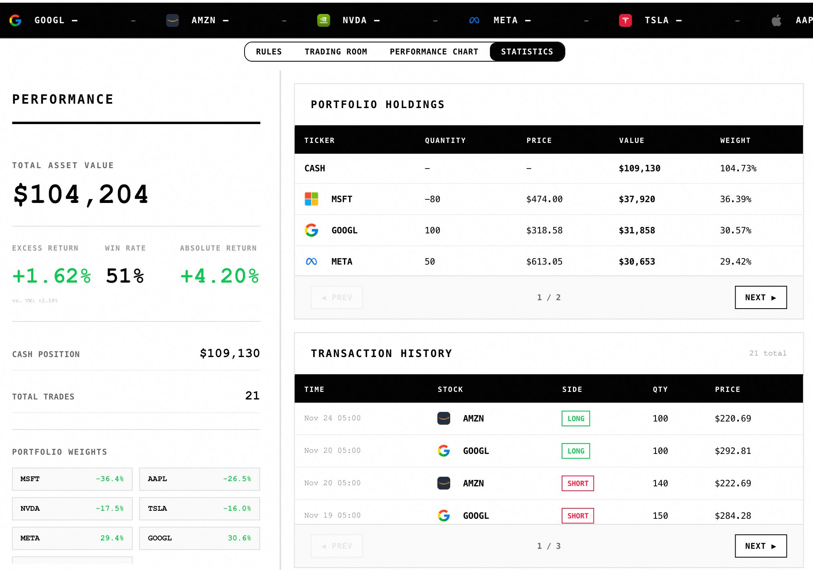
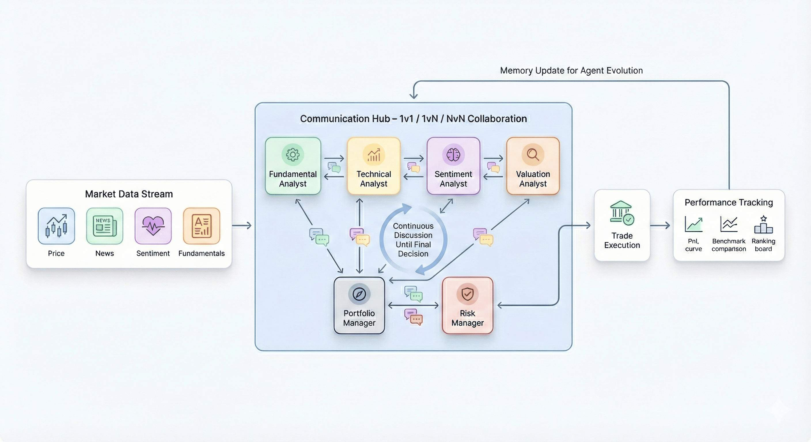

<p align="center">
  
</p>

<h2 align="center">EvoTraders：自我进化的多智能体交易系统</h2>


<p align="center">
  📌 <a href="http://trading.evoagents.cn">Visit us at EvoTraders website !</a>
</p>



EvoTraders是一个开源的金融交易智能体框架，通过多智能体协作和记忆系统，构建能够在真实市场中持续学习与进化的交易系统。

---

## 核心特性

**多智能体协作交易**
6名成员，包含4种专业分析师角色（基本面、技术面、情绪、估值）+ 投资组合经理 + 风险管理，像真实交易团队一样协作决策。

你可以在这里自定义你的Agents，支持配置不同大模型（如 Qwen、DeepSeek、GPT、Claude等）协同分析：[自定义配置](#自定义配置)

**持续学习与进化**
基于 ReMe 记忆框架，智能体在每次交易后反思总结，跨回合保留经验，形成独特的投资方法论。

通过这样的设计，我们希望当 AI Agents 组成团队进入实时市场，它们会逐渐形成自己的交易风格和决策偏好，而不是一次性的随机推理


**实时市场交易**
支持实时行情接入，提供回测模式和实盘模式，让 AI Agents 在真实市场波动中学习和决策。

**可视化交易信息**
实时观察 Agents 的分析过程、沟通记录和决策演化，完整追踪收益曲线和分析师表现。


<p>
  
  
</p>


---

## 快速开始

### 安装

```bash
# 克隆仓库
git clone https://github.com/agentscope-ai/agentscope-samples
cd agentscope-samples/EvoTraders

# 安装依赖(推荐使用uv）
uv pip install -e .
# (可选）pip install -e .

# 配置环境变量
cp env.template .env
# 编辑 .env 文件，添加你的 API Keys,以下的配置项为必填项

# finance data API:至少需要FINANCIAL_DATASETS_API_KEY，对应FIN_DATA_SOURCE=financial_datasets；推荐添加FINNHUB_API_KEY，对应至少需要FINANCIAL_DATASETS_API_KEY，对应FIN_DATA_SOURCE填为finnhub;如果使用live 模式必须添加FINNHUB_API_KEY
FIN_DATA_SOURCE=   #finnhub or financial_datasets
FINANCIAL_DATASETS_API_KEY=  #必需
FINNHUB_API_KEY=  #可选

# LLM API for Agents
OPENAI_API_KEY=
OPENAI_BASE_URL=
MODEL_NAME=qwen3-max-preview

# LLM & embedding API for Memory
MEMORY_API_KEY=
```

### 运行

**回测模式：**
```bash
evotraders backtest --start 2025-11-01 --end 2025-12-01
evotraders backtest --start 2025-11-01 --end 2025-12-01 --enable-memory # 使用记忆

```

进行多股票池或 PM/分析师规则实验前，请先阅读
[`docs/experiment_protocol.md`](docs/experiment_protocol.md)。实验应先跑 1 天连通性
smoke 和 3-5 天行为 smoke，确认无明显数据、工具、PM 行为问题后，再跑完整月份。

如果没有可用的行情 API，想快速体验回测 demo，可直接下载离线数据并解压到 `backend/data`：
```bash
wget "https://agentscope-open.oss-cn-beijing.aliyuncs.com/ret_data.zip"
unzip ret_data.zip -d backend/data
```
该压缩包提供基础的股票行情数据，解压后即可直接用于回测演示。

**实盘交易：**
```bash
evotraders live                    # 立即运行（默认）
evotraders live --enable-memory    # 使用记忆
evotraders live --mock             # Mock 模式（测试）
evotraders live -t 22:30           # 每天本地时间 22:30 运行（自动转换为 NYSE 时区）
```

**获取帮助：**
```bash
evotraders --help           # 查看整体命令行帮助
evotraders backtest --help  # 查看回测模式的参数说明
evotraders live --help      # 查看实盘/Mock 运行的参数说明
```

**启动可视化界面：**
```bash
# 确保已安装 npm, 否则请安装：
# npm install
evotraders frontend                # 默认连接 8765 端口, 你可以修改 ./frontend/env.local 中的地址从而修改端口号
```

访问 `http://localhost:5173/` 查看交易大厅，选择日期并点击 Run/Replay 观察决策过程。

---

## 系统架构



### 智能体设计

**分析师团队：**
- **基本面分析师**：财务健康度、盈利能力、增长质量
- **技术分析师**：价格趋势、技术指标、动量分析
- **情绪分析师**：市场情绪、新闻舆情、内部人交易
- **估值分析师**：DCF、剩余收益、EV/EBITDA

**决策层：**
- **投资组合经理**：整合来自分析师的分析信号，执行沟通策略，结合分析师和团队历史表现、近期投资记忆和长期投资经验，进行最终决策
- **风险管理**：实时价格与波动率监控、头寸限制，多层风险预警

### 决策流程

```
实时行情 → 独立分析 → 智能沟通 (1v1/1vN/NvN) → 决策执行 → 收益评估 → 学习与进化（记忆更新）
```

每个交易日经历五个阶段：

1. **分析阶段**：各智能体基于各自工具和历史经验独立分析
2. **沟通阶段**：通过私聊、通知、会议等方式交换观点
3. **决策阶段**：投资组合经理综合判断，给出最终交易
4. **评估阶段**
   - **业绩图表**: 追踪组合收益曲线 vs. 基准策略（等权、市值加权、动量）。用于评估整体策略有效性。

   - **分析师排名**: 在 Trading Room 点击头像查看分析师表现（胜率、牛/熊市胜率）。用于了解哪些分析师提供最有价值的洞察。

   - **统计数据**: 详细的持仓和交易历史。用于深入分析仓位管理和执行质量。

4. **复盘阶段**：Agents 根据当日实际收益反思决策、总结经验，并存入 ReMe 记忆框架以持续改进

---

### 模块支持

- **智能体框架**：[AgentScope](https://github.com/agentscope-ai/agentscope)
- **记忆系统**：[ReMe](https://github.com/agentscope-ai/reme)
- **LLM 支持**：OpenAI、DeepSeek、Qwen、Moonshot、Zhipu AI 等


---

## 自定义配置

### 自定义分析师角色

1. 在 [./backend/agents/prompts/analyst/personas.yaml](./backend/agents/prompts/analyst/personas.yaml) 中注册角色信息，例如：

```yaml
comprehensive_analyst:
  name: "Comprehensive Analyst"
  focus:
    - ...
  preferred_tools:   # Flexibly select based on situation
  description: |
    As a comprehensive analyst ...
```

2. 在 [./backend/config/constants.py](./backend/config/constants.py) 添加角色定义
```python
ANALYST_TYPES = {
    # 增加新的分析师
    "comprehensive_analyst": {
        "display_name": "Comprehensive Analyst",
        "agent_id": "comprehensive_analyst",
        "description": "Uses LLM to intelligently select analysis tools, performs comprehensive analysis",
        "order": 15
    }
}
```

3. 在前端配置 [./frontend/src/config/constants.js](./frontend/src/config/constants.js) 中引入新角色（可选）
```javascript
export const AGENTS = [
    // 覆盖掉其中某一个agent
  {
    id: "comprehensive_analyst",
    name: "Comprehensive Analyst",
    role: "Comprehensive Analyst",
    avatar: `${ASSET_BASE_URL}/...`,
    colors: { bg: '#F9FDFF', text: '#1565C0', accent: '#1565C0' }
  }
  ]
```


### 自定义模型

在 [.env](.env) 文件中配置不同智能体使用的模型：

```bash
AGENT_SENTIMENT_ANALYST_MODEL_NAME=qwen3-max-preview
AGENT_FUNDAMENTAL_ANALYST_MODEL_NAME=deepseek-chat
AGENT_TECHNICAL_ANALYST_MODEL_NAME=glm-4-plus
AGENT_VALUATION_ANALYST_MODEL_NAME=moonshot-v1-32k
```

### 项目结构

```
EvoTraders/
├── backend/
│   ├── agents/           # 智能体实现
│   ├── communication/    # 通信系统
│   ├── memory/          # 记忆系统 (ReMe)
│   ├── tools/           # 分析工具集
│   ├── servers/         # WebSocket 服务
│   └── cli.py           # CLI 入口
├── frontend/            # React 可视化界面
└── logs_and_memory/     # 日志和记忆数据
```

---

## 许可与免责

EvoTraders 是一个研究和教育项目，采用 Apache 2.0 许可协议开源。

**风险提示**：在实际资金交易前，请务必进行充分的测试和风险评估。历史表现不代表未来收益，投资有风险，决策需谨慎。
