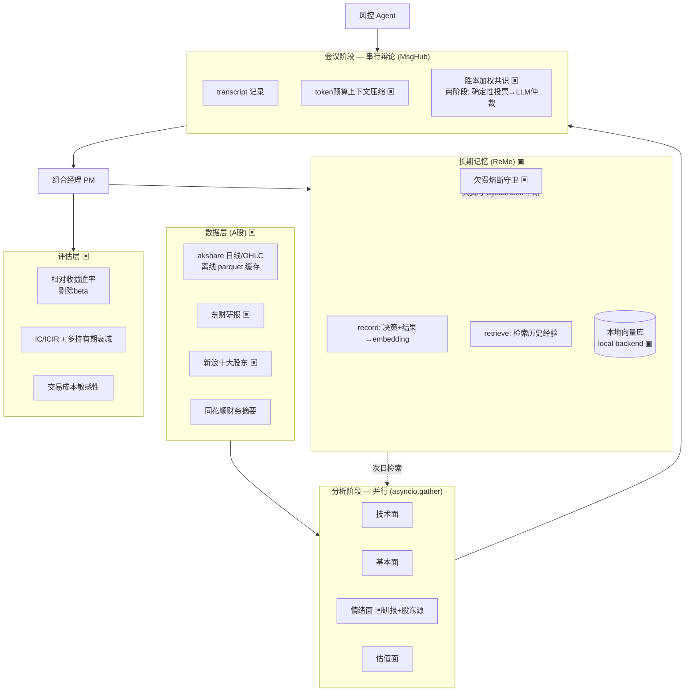

# EvoTraders 扩展工作说明（个人贡献）

> **定位**：本文档记录在开源项目 [EvoTraders](http://trading.evoagents.cn)（AgentScope 多智能体交易框架）
> 基础上所做的**扩展与改造**，用于项目复盘与面试说明。
> 上游提供了 ReActAgent / MsgHub / 工具调用 / 前端看板等基础设施；
> 以下内容是在其之上新增的决策机制、数据工程、评估方法学与可靠性工程。

---

## 1. 系统架构（▣ = 本人扩展点）

---

## 2. 核心扩展

### 2.1 多智能体决策层（`backend/core/pipeline.py`，+456/-169 行）

| 扩展 | 说明 | 关键实现 |
|------|------|---------|
| **胜率加权共识** | 分析师历史胜率作为投票权重，含冷启动 fallback(0.5)；两阶段提前停止——先跑免费的确定性加权投票，仅在分歧(ambiguous)时才调用 LLM 仲裁，降低会议阶段成本 | `_get_analyst_weights` / `_compute_weighted_consensus` / `_consensus_reached` |
| **token 预算上下文管理** | 多轮辩论 transcript 超预算时按「近期逐字 + 早期摘要」分层压缩，把上下文增长从 O(轮数) 限到 O(预算)，并保留下游共识所需的 `[STANCE]` 标签 | `_render_transcript` / `_estimate_tokens`（配 3 个单测） |
| **无状态共识仲裁** | 仲裁走 `pm.model()` 直接调模型、绕过 agent memory，避免记忆污染共识判断 | `_consensus_reached` Stage 2 |
| **并行分析 / 串行辩论** | 分析阶段 `asyncio.gather` 并行（保证观点独立），会议阶段串行逐轮传递上下文（支持辩论） | `_run_analysts_with_sync` |
| **调用画像** | monkey-patch `reply()` 统计单日 LLM 调用数与耗时 | `_CycleProfiler` |

### 2.2 A股数据工程（`backend/tools/`, `backend/data/`）

- **替代数据源**：东财公告接口不稳定 → 接入东财研报 + 新浪十大股东作为机构视角源（`get_ashare_research_reports` / `get_ashare_top_holders`）
- **前视偏差防护**：按**公告日期**而非截止日期过滤财报/股东数据，杜绝未来信息泄露
- **离线开关**：`A_SHARE_PRICE_CACHE_ONLY` / `A_SHARE_CRAWL_CACHE_ONLY`，缓存未命中即跳过，支持无网回测

### 2.3 评估方法学（`backend/utils/analyst_tracker.py`, `scripts/`）

- **beta 污染修复**：发现绝对收益口径(close>open)在市场普跌日令所有看多判错，改用**相对收益**(个股 vs 池均涨跌幅)衡量纯选股能力 → 情绪面胜率从 0% 修正到 50%
- **统计显著性检验**：二项检验评估方向预测能力（`scripts/evaluate_two_quarter.py`）
- **量化口径分析**：IC/ICIR + 多持有期衰减 + 交易成本敏感性 + 朴素 RSI 基线对比（`scripts/quant_signal_analysis.py`）

### 2.4 长期记忆实验（`run_backtest.py`, ReMe 集成）

- **A/B 实验设计**：有记忆 vs 无记忆对照，唯一差别是记忆开关
- **静默失败排查**：定位 record() 调用成功但 embedding 因欠费写入失败、框架 `except Exception` 吞异常——日志与看板均无异常，仅 A/B 微样本对比暴露
- **欠费熔断守卫**：embedding 欠费时升级为 `SystemExit`（穿透框架的 `except Exception`），主动中断避免静默退化为无记忆基线
- **本地持久化向量库**：ReMe 默认 memory backend 进程退出即丢失 → 改用 local backend 持久化到 jsonl

### 2.5 可靠性工程（`scripts/run_until_done.sh`）

- 自动重试 + 断点续跑：以 nav_curve.csv 为 checkpoint，应对 LLM API 偶发 402/503/超时，支撑数十小时无人值守回测

---

## 3. 关键结论

### 3.1 分析师预测能力（B 组 / 无记忆，Q1+Q2 2025）

- **技术面是唯一稳定正 alpha 的角色**：相对收益口径胜率 53.8%（n=1129, p=0.012，统计显著）
- **基本面稳定负 alpha**：符合理论——基本面是长周期逻辑，不应以日频相对收益评判
- **量化口径的诚实补充**：绝对收益 IC 仅技术面为正(+0.018)且微弱；信号呈**慢趋势特征**（T+5 命中率 60% vs T+0 49%）；**扣 0.35% 交易成本后净收益转负**——横截面相对选股有微弱 alpha，但绝对时机 alpha 不足、日频下无法落地

### 3.2 记忆 A/B 结论（同时段 2025-02-10~03-31，33 交易日）

> 注：A 组多次崩溃重启致 leaderboard 聚合计数被部分重置，故 A/B 均从**运行日志**解析信号
> （`scripts/compare_ab.py`），规避损坏数据。

| 指标（4 分析师均值） | B 无记忆 | A 有记忆 | Δ |
|---|---|---|---|
| 相对胜率 T0 | 43.4% | 48.8% | **+5.4pp** |
| IC (T+1) | −0.0247 | −0.0033 | **+0.0213** |
| 扣成本净收益/笔 | −0.35% | −0.29% | +0.06pp |

- **记忆带来一致的小幅信号质量提升**：4 个分析师的相对胜率与 IC **全部**改善（非个别波动），情绪面/估值面受益最大（+7.3pp / +8.4pp），技术面几乎不变（本就最强、依赖实时指标）
- **IC 从明显负转向接近零**：记忆把信号从"反向"拉回"无偏"
- **但仍不足以覆盖交易成本**：扣 0.35% 成本后净收益依旧为负——记忆改善了信号，没改变"日频不可落地"的结论

**诚实声明（关键）**：A/B 各仅运行一次，LLM temperature 随机性使得 +5.4pp 中"记忆贡献"与"运行间随机波动"**无法在单次实验中完全区分**；4 个分析师方向一致降低了纯随机的可能，但严格结论需多 seed 重复。属**初步证据**而非因果定论。

---

## 4. 方法学局限（诚实声明）

- **股池选择偏差**：8 只股池用 2024-12-31 截面三层漏斗选出后回测 2025，含前视选择偏差，属"固定池策略验证"而非"选股能力验证"
- **单季度 / 单 regime**：A/B 仅覆盖单季度，结论不可外推到牛熊不同市场环境
- **信号 confidence 未持久化**：量化分析的信号从运行日志回捞，覆盖率约 84%
- **LLM 非确定性**：temperature>0 致每次运行结果有别，单次实验未做多次重复取均值
