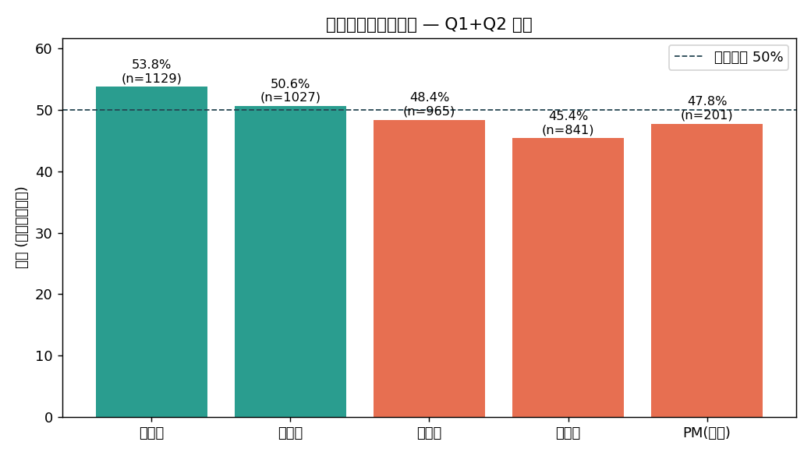
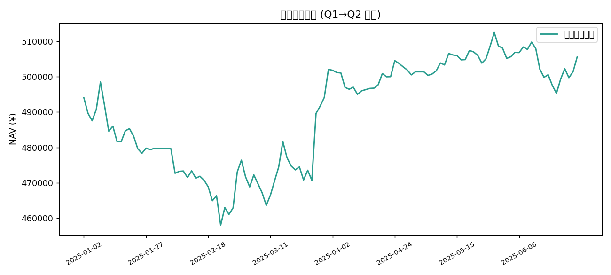

# EvoTraders 回测评估报告 (Q1 + Q2 2025)

> 口径：**相对收益** —— 看多正确 = 个股当日涨跌幅 > 8 股池平均涨跌幅；看空正确 = 低于池均。剔除市场 beta，衡量纯选股能力。

## 一、分析师方向预测胜率

| 分析师 | evo2025_q1 | evo2025_q2 | 合并胜率 | 样本 | p值(vs 50%) | 结论 |
|---|---|---|---|---|---|---|
| 技术面 | 51.5% | 58.0% | **53.8%** | 1129 | 0.0124 | ✅ 显著正 alpha |
| 情绪面 | 50.0% | 51.9% | **50.6%** | 1027 | 0.7081 | ≈ 随机 |
| 估值面 | 46.4% | 51.4% | **48.4%** | 965 | 0.3342 | ≈ 随机 |
| 基本面 | 42.8% | 49.5% | **45.4%** | 841 | 0.0087 | ⚠️ 显著负 alpha |
| PM(综合) | 42.0% | 60.3% | **47.8%** | 201 | 0.5727 | ≈ 随机 |

## 二、策略绩效 vs 基准

数据来自各季度 `stats.json`(按季度独立年化)。基准 = 等权买入持有 8 股池。

| 季度 | 策略收益 | 等权基准收益 | 超额 | 策略Sharpe | 基准Sharpe | 策略最大回撤 |
|---|---|---|---|---|---|---|
| evo2025_q1 | 0.41% | 10.41% | **-10.0%** | 0.132 | 1.107 | -8.39% |
| evo2025_q2 | 1.15% | 6.54% | **-5.39%** | 0.741 | 1.233 | -3.36% |

- 两季度连续净值总收益：**+2.33%**，最大回撤 **8.11%**

**诚实评价**：策略两季度均**跑输等权基准**。根因是组合长期持有大量现金(防御姿态)，在 2025 上半年 A 股反弹中踏空。低波动带来回撤更小、Sharpe 不算差，但绝对收益落后——这是「分析师有局部 alpha ≠ 组合能赚钱」的典型案例，PM 的资金配置与时机才是收益瓶颈。

## 三、关键结论

1. **技术面分析师是唯一稳定正 alpha 的角色**——两季度均 >50%，合并样本下统计显著。
2. **基本面分析师稳定负 alpha**——符合理论：基本面是长周期逻辑，不应以日频相对收益评判，本身是对评估口径的一种验证。
3. **PM 样本量仍偏小**——方向性提升明显但未达强显著，诚实标注为「需更长周期确认」。
4. **beta 污染的发现与修复**：绝对口径下市场下跌日令所有多头判错，切换相对口径后情绪面分析师胜率从 0%→50%，是评估方法论的核心案例。